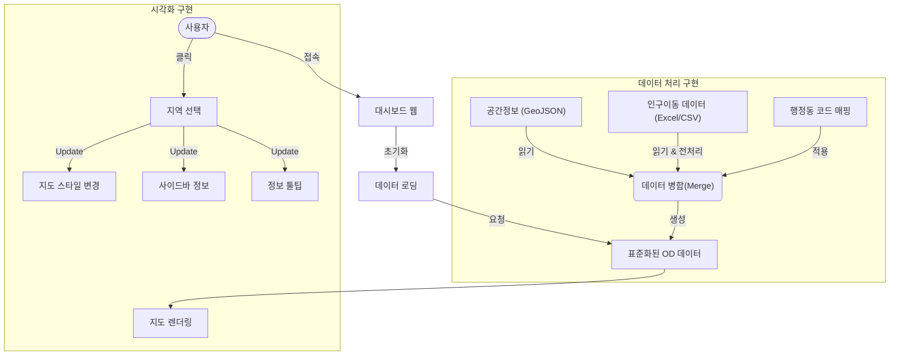

# 인구이동 시각화 대시보드 구축 워크플로우 (popMove_instruction)

본 문서는 인구이동 시각화 대시보드의 데이터 처리부터 시각화 구현까지의 전체 과정을 요약합니다.

## User Workflow Diagram

---

## 1. 공간정보 읽기 (Spatial Data)
*   **데이터 소스**: `sigungu.json` (대한민국 시군구 행정구역 경계 데이터)
*   **처리 내용**:
    *   TopoJSON/GeoJSON 형식을 로드하여 Leaflet 지도 레이어로 변환.
    *   각 Feature의 `SIGUNGU_CD` (법정동 코드)를 식별자로 사용.

## 2. 인구이동 읽기 (Population Movement Data)
*   **데이터 소스**: 통계청 인구이동 데이터 (`.csv`, `.xlsx`)
*   **핵심 처리 (`process_od_data.py`)**:
    *   **2023년 vs 2024년 데이터 불일치 보정**:
        *   **부천시 분할**: 2023년 통합 부천시(`41190`) 데이터를 2024년 3개 구(원미/소사/오정)의 가구수 비율(약 54:29:17)로 안분하여 할당.
        *   **행정구역 변경**: 전북(`45`→`52`) 및 군위군(`47720`→`27720`) 코드 변환 적용.
    *   **결측치 처리**: 데이터가 없는 이동 경로는 `0`으로 처리하여 계산 오류 방지.

## 3. 코드 매핑 (Code Mapping)
*   **목표**: 서로 다른 코드 체계(공간정보의 법정동 코드 vs 통계 데이터의 행정동 코드)를 연결.
*   **주요 로직**:
    *   `2024_description.xlsx`를 기준으로 매핑 테이블 생성.
    *   **폐지 코드 필터링**: `말소일자`가 없는(Active) 코드만 추출하여 중복 방지.
    *   **예외 처리**: 자동 매핑이 어긋나는 지역(평택시 `41220`, 세종시 등)에 대해 강제 매핑 적용.
*   **산출물**: `code_mapping.json` (Geo Code ↔ Admin Code 변환 사전)

## 4. 레이아웃 구성 (Layout)
전체 레이아웃은 **Light Mode**를 기반으로 깔끔하고 직관적으로 구성했습니다.

*   **좌측 사이드바 (Sidebar)**:
    *   **컨트롤 패널**: 서비스 선택, 전입/전출 모드 토글(Toggle).
    *   **정보 패널**: 선택된 지역의 상세 통계(총 이동량, 순이동, 세대당 평균 인원) 표시.
    *   **랭킹 테이블**: 선택된 지역과 연관된 Top/Bottom 20 지역 리스트 제공 (Excel 다운로드 지원).
*   **우측 지도 영역 (Map Container)**:
    *   전체 화면을 활용한 지도 표시.
    *   **플로팅 범레 (Floating Legend)**: 우측 하단에 인구 범위 범례를 오버레이 형태로 배치하여 공간 효율성 증대.

## 5. 시각화 (Visualization)
사용자 편의성과 데이터 전달력을 높이기 위해 세부적인 스타일링을 적용했습니다.

*   **색상 체계 (Color Scheme)**:
    *   **전입 (Inflow)**: **파란색 (Blue)** 계열 (긍정적/유입 이미지)
    *   **전출 (Outflow)**: **빨간색 (Red)** 계열 (부정적/유출 이미지)
    *   **데이터 없음**: **흰색 (White)** 채움 + 짙은 회색 테두리(`#444`)로 명확히 구분.
*   **인터랙션 (Interaction)**:
    *   **Hover**: 마우스 오버 시 해당 지역의 이동량, 세대수, **전년대비 증감(Diff)** 정보를 툴팁으로 표시.
    *   **Click**: 지역 선택 시 해당 지역을 기준으로 연결된 모든 지역의 색상을 재계산하여 렌더링.
    *   **추정치 안내**: 부천시와 같이 데이터가 추정(분할)된 경우, 툴팁과 테이블에 **"분구로 인한 변화량 추정"** 문구(주황색) 표시.
