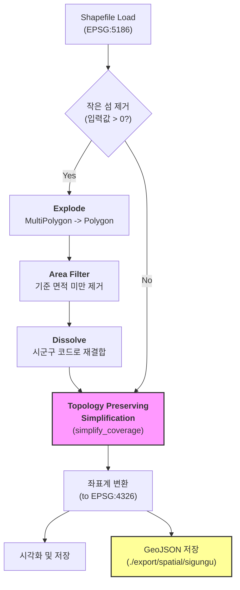

# 시군구 Shapefile 시각화 가이드

이 문서는 대한민국 시군구 공간정보(Shapefile)를 시각화하고, 위상(Topology)을 보존하며 경계를 단순화(Simplification)하는 프로세스를 설명합니다.

## 1. 코드 중요 요소

### 1.1 위상 보존 단순화 (Topology Preserving Simplification)
- **Problem**: 일반적인 경계 단순화(`simplify`)는 각 폴리곤을 독립적으로 처리하므로, 공유 경계선에서 틈(Gap)이 벌어지거나 서로 겹치는(Overlap) 문제가 발생합니다.
- **Solution**: `geopandas.GeoSeries.simplify_coverage()` 메서드를 사용합니다. 이 기능은 인접한 폴리곤들의 집합(Coverage)을 고려하여 공유 경계선을 일관되게 단순화함으로써 위상 관계를 완벽하게 유지합니다.

### 1.2 좌표계 (Coordinate Reference Systems)
- **입력 (Input)**: `EPSG:5186` (Korea 2000 / Central Belt 2010). 미터(m) 단위로 정의되어 있어 단순화 연산 시 거리 계산의 기준이 됩니다.
- **출력 (Output)**: `EPSG:4326` (WGS84). 위도(Latitude)와 경도(Longitude) 좌표계로 변환하여 지도 시각화에 사용됩니다.

## 2. 처리 프로세스 (Workflow)

데이터가 시각화되기까지의 과정은 다음과 같습니다.



1. **데이터 로드**: 미터 단위 좌표계(`EPSG:5186`)로 원본 데이터를 읽습니다.
2. **전처리 (Pre-processing)**:
   - 사용자가 최소 면적을 입력하면, `Explode`를 통해 모든 Polygon(섬)을 분리합니다.
   - 입력된 기준보다 작은 면적의 Polygon을 제거합니다.
   - `Dissolve`를 통해 남은 Polygon들을 다시 시군구 단위로 합칩니다.
3. **단순화 (Simplification)**:
   - **`simplify_coverage`**를 사용하여 모든 시군구 경계선을 한꺼번에 단순화합니다. 이 과정에서 공유 경계선이 유지됩니다.
4. **변환 및 저장**:
   - 최종 결과물을 위경도(`EPSG:4326`)로 변환합니다.
   - **시각화**: 지도 이미지를 생성합니다.
   - **GeoJSON**: 웹 표준 포맷으로 파일(`{날짜}_sigungu_simplified.json`)을 저장합니다.

## 3. 실행 방법

1. **필수 패키지 설치** (최초 1회)
   ```bash
   uv pip install geopandas matplotlib shapely
   ```
   > `uv run`을 사용하면 실행 시 자동으로 의존성을 관리할 수도 있습니다.

2. **스크립트 실행**
   ```bash
   uv run python visualize_sigungu.py
   ```

3. **입력 예시**
   프로그램이 실행되면 두 번의 입력을 요청합니다.

   **1) 작은 섬 제거 기준 (km²)**
   ```text
   제거할 작은 섬의 최소 면적을 km² 단위로 입력하세요 (기본값: 0, 엔터 시 생략): 0.5
   ```
   - `0.5` 입력 시: 0.5km² 미만의 섬들은 지도에서 사라집니다. (시각적 노이즈 감소)
   - 엔터만 입력 시: 모든 섬을 유지합니다.

   **2) 단순화 정도 (km)**
   ```text
   단순화 정도를 km 단위로 입력하세요 (기본값: 1): 1.5
   ```
   - `1.5` 입력 시: 경계선이 1.5km 단위로 단순화됩니다.

4. **결과 확인**
   - **이미지**: `./export/sigungu_visualization.png`
   - **데이터**: `./export/spatial/sigungu/{날짜}_sigungu_simplified.json`

## 3. 문제점 및 해결 방법 (Troubleshooting)

### 3.1 `AttributeError: 'GeoSeries' object has no attribute 'simplify_coverage'`
- **원인**: `geopandas` 버전이 낮거나 `shapely` 2.1 이상이 설치되지 않은 경우 발생합니다.
- **해결**: 라이브러리를 최신 버전으로 업데이트하세요.
  ```bash
  uv pip install --upgrade geopandas shapely
  ```
- **대안**: 스크립트는 이 에러 발생 시 자동으로 기존 `simplify(preserve_topology=True)` 방식으로 전환되도록 예외 처리가 되어 있습니다.

### 3.2 한글 폰트 깨짐 (ㅁㅁㅁㅁ 표시)
- **원인**: 시스템에 설정된 한글 폰트(코드상의 `AppleGothic`)가 없을 때 발생합니다.
- **해결**: `visualize_sigungu.py` 파일 상단의 `plt.rcParams['font.family']` 값을 운영체제에 맞는 폰트로 변경하세요.
  - Windows: `'Malgun Gothic'` (맑은 고딕)
  - Linux: `'NanumGothic'` (나눔고딕 등)

### 3.3 Shapefile 인코딩 오류
- **현상**: 지역명이 깨져서 보이거나 읽기 오류 발생.
- **해결**: `gpd.read_file()` 함수 내 `encoding` 파라미터를 `'euc-kr'` 또는 `'cp949'`로 명시적으로 지정하여 수정해 보세요. (현재 코드는 자동 감지 또는 cp949 시도)
